# AwesomeProject

----------------------------------------------------------------------

### Firebase

- Add project "put the name of the project"

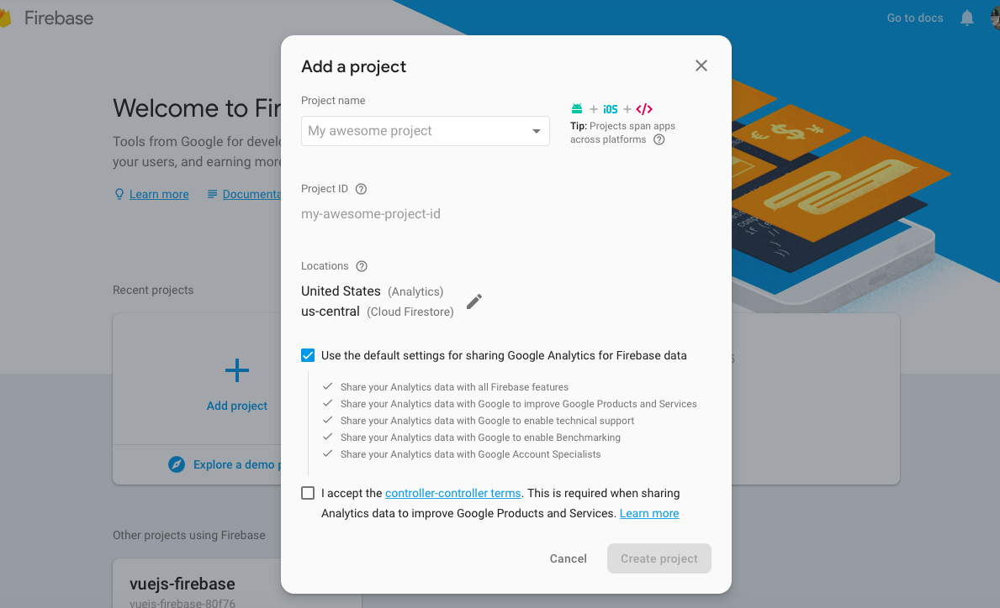

- Acess menu Project Settings

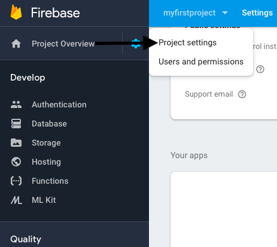

- Click add firebase to your web app

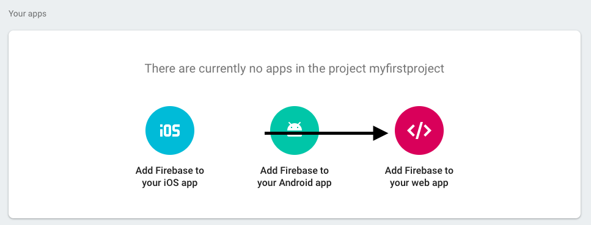

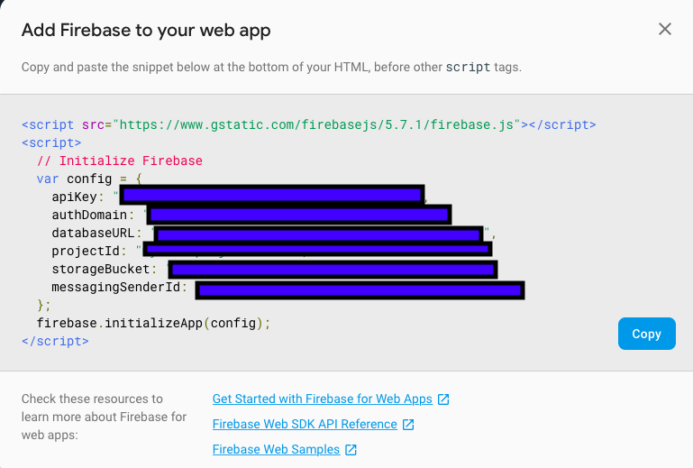

- Replace the file config/config.js
```
var config = {
    apiKey: API_KEY,
    authDomain: AUTH_DOMAIN,
    databaseURL: DATABASE_URL,
    projectId: PROJECT_ID,
    storageBucket: STORAGE_BUCKET,
    messagingSenderId: MESSAGING_SENDER_ID
};

```

#### Firebase Authentication configure

- Email/Password
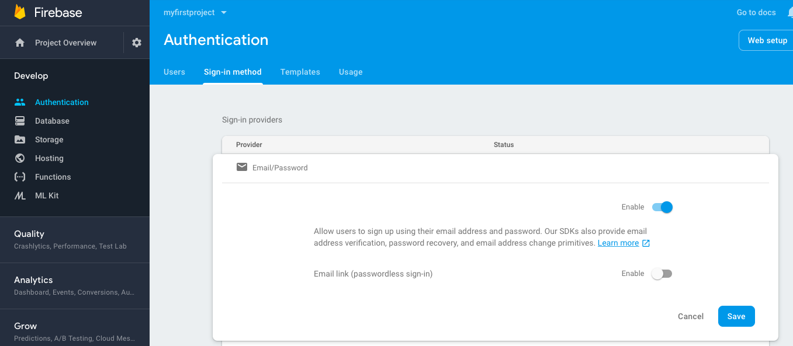


- Facebook authentication "require steps facebook"

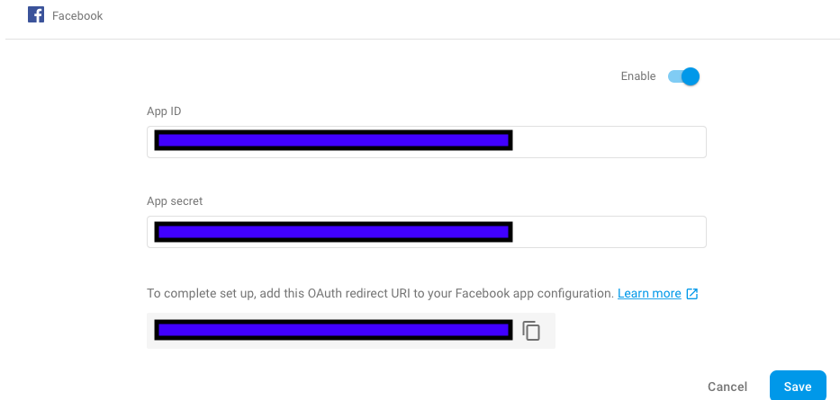


----------------------------------------------------------------------

### Facebook

- create new App
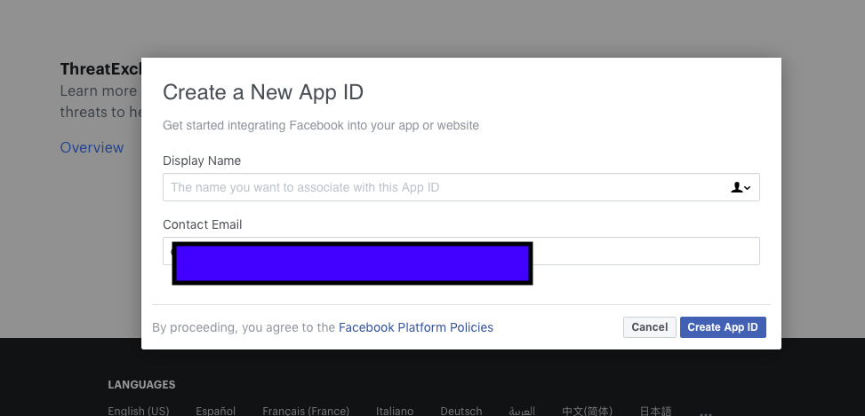

- Select facebook "Login"and Click "+ Add Plataform" and add IOS and Android

    - Add IOS "host.exp.Exponent" and ANDROID "rRW++LUjmZZ+58EbN5DVhGAnkX4=" link https://docs.expo.io/versions/latest/sdk/facebook
 
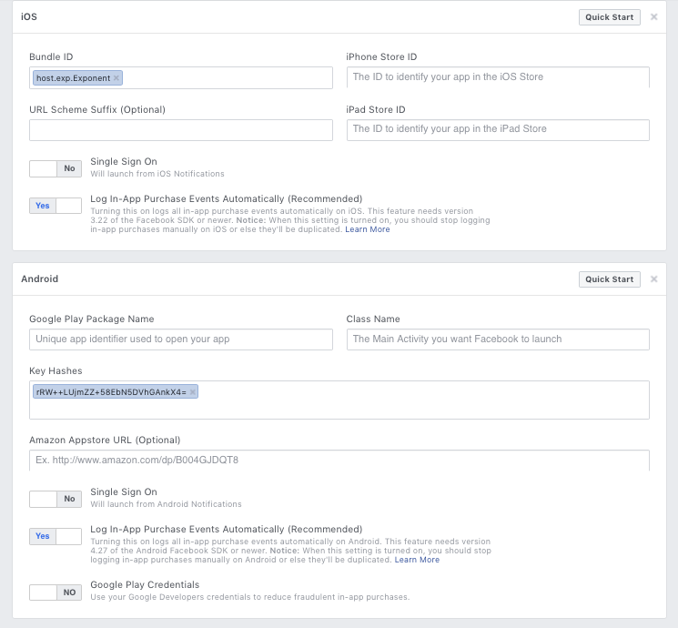  

- Configure login facebook in project "replace the method loginWithFacebook in the App.js" 
```
    async loginWithFacebook() {
        const {type, token} = await Expo.Facebook.logInWithReadPermissionsAsync(
            'APP_ID',
            {permissions: ['email', 'public_profile']}
        );

        if (type === 'success') {
            const credentials = f.auth.FacebookAuthProvider.credential(token);
            f.auth().signInWithCredential(credentials).catch((error) => {
                console.log('Error ....', error)
            })
        }
    }


```


----------------------------------------------------------------------


### Project running


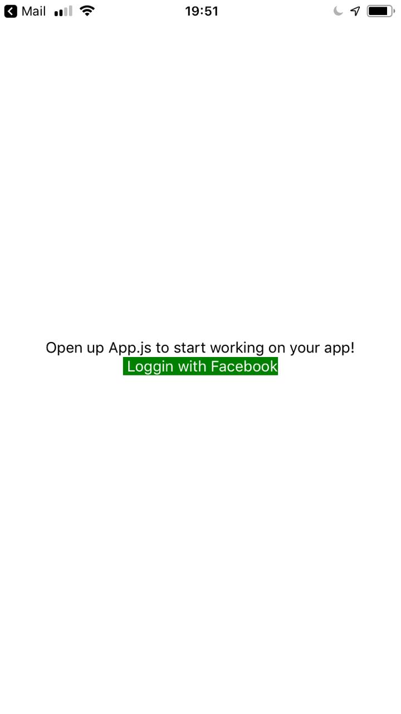
 
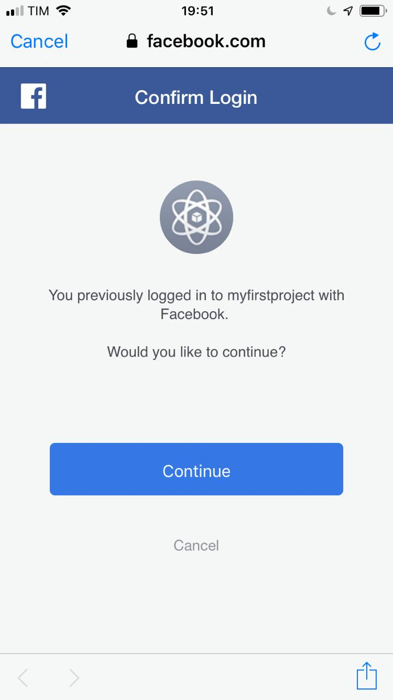

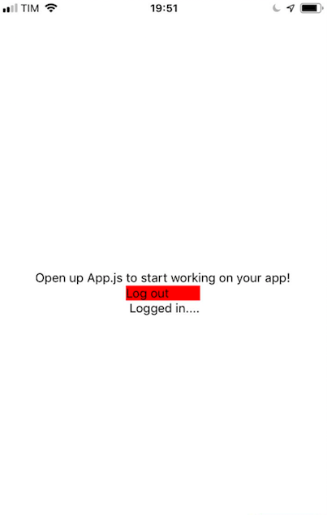
