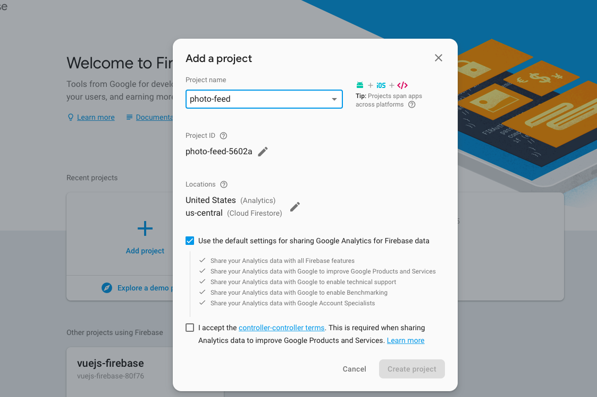
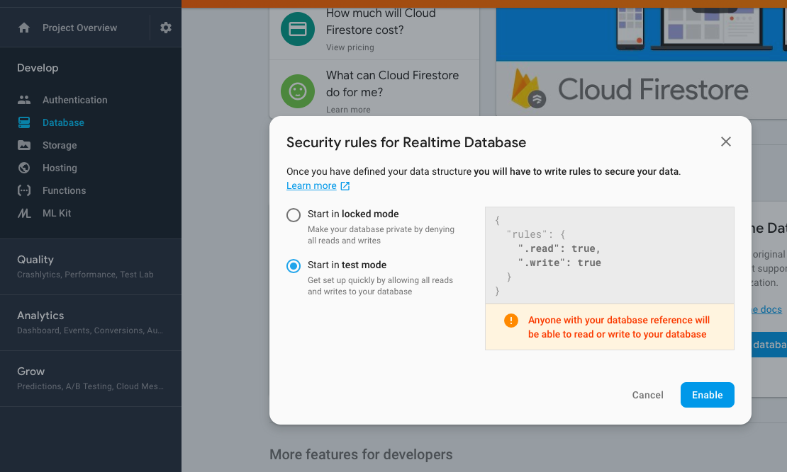
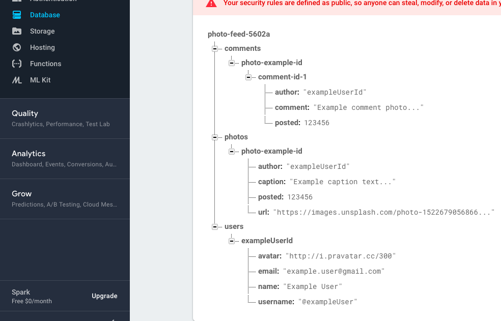
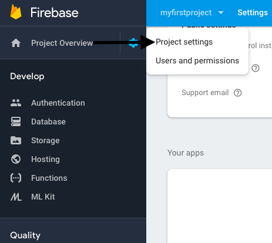
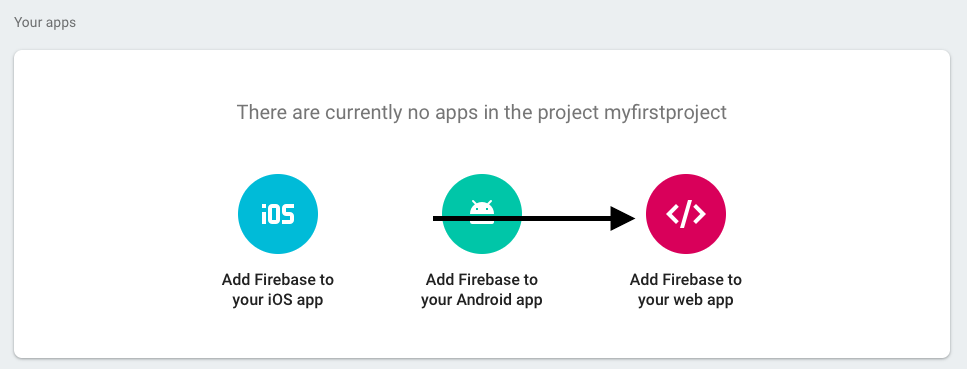
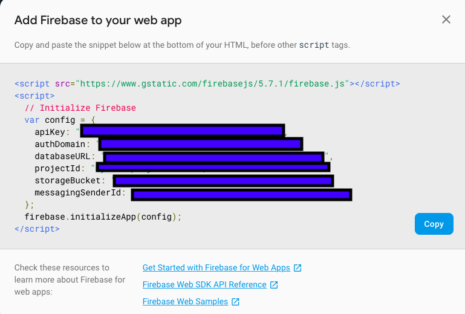

# photo-feed

----------------------------------------------------------------------

### Firebase

- Add project



- Create database





- Acess menu Project Settings



- Click add firebase to your web app





- Replace the file config/config.js

```
var config = {
    apiKey: API_KEY,
    authDomain: AUTH_DOMAIN,
    databaseURL: DATABASE_URL,
    projectId: PROJECT_ID,
    storageBucket: STORAGE_BUCKET,
    messagingSenderId: MESSAGING_SENDER_ID
};

```