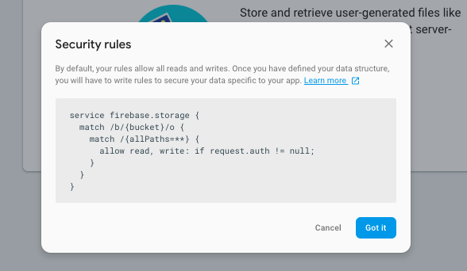

# photo-feed

----------------------------------------------------------------------

### Firebase

- Add project


- Create database


- Acess menu Project Settings


- Click add firebase to your web app


- Replace the file config/config.js

```

var config = {
    apiKey: API_KEY,
    authDomain: AUTH_DOMAIN,
    databaseURL: DATABASE_URL,
    projectId: PROJECT_ID,
    storageBucket: STORAGE_BUCKET,
    messagingSenderId: MESSAGING_SENDER_ID
};

```

- Firebase rules


    
```

{
  "rules": {
    "photos":{
      //Anyone can read photos
      ".read": true,
    	"$photoId": {
        //Can only write or edit if you are the author
        ".write": "root.child('photos').child($photoId).child('author').val() == auth.uid || newData.child('author').val() == auth.uid",
        "author":{
          ".validate": "newData.val() == auth.uid"
        }
      }
    },
    "users": {
      "$userId": {
      	".read": "auth.uid == $userId",
        ".write": "auth.uid == $userId",
        "username": {
        	".read": true
        },
        "name": {
        	".read": true
        },
        "avatar": {
        	".read": true
        },
        "photos": {
        	".read": true
        },
        "email": {
          ".read": "auth.uid == $userId"
        }
      }
    },
    "comments": {
      //Anyone can read comments
      ".read": true,
      "$photoId": {
        "$commentId": {
          ".write": "root.child('comments').child($photoId).child($commentId).child('author').val() == auth.uid || newData.child('author').val() == auth.uid",
          "author": {
            ".validate": "newData.val() == auth.uid"
          }
        }
      }
    }
  }
}

```


- Firebase Authentication


- Firebase storage




----------------------------------------------------------------------


- User Test
```
Email : test@user.com 
Passsword: password
```
